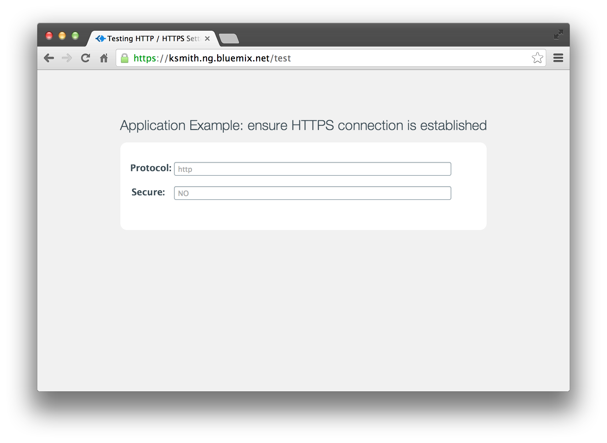
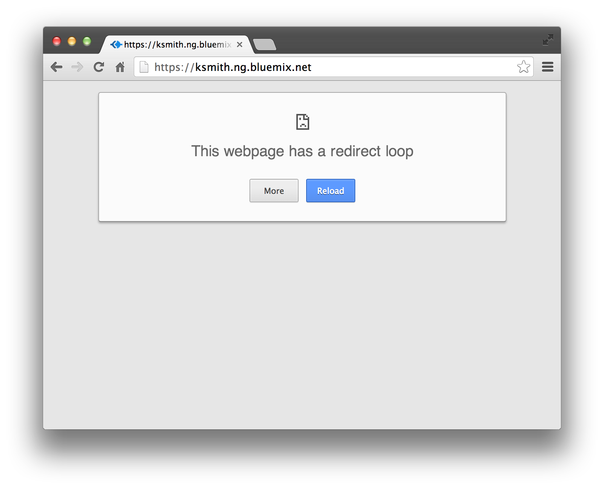
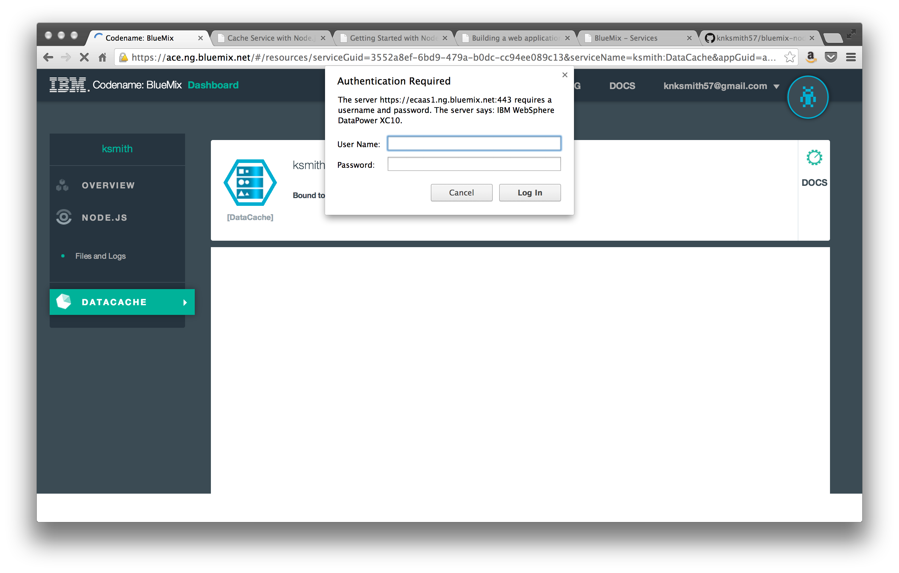

Issues / Bugs Encountered
=========================

I'm brand spankin' new to BlueMix, so here's a (hopefully small!) collection of issues I've had getting started.

1. `HTTPS` is not properly forwarding in express. Not sure how to go about debugging this. Basically, `https://` reqs aren't properly detected in express and I think it has
   something to do with the way you guys are internally forwarding from `:80` to `:app-port`.

   Le code:
   ```javascript
    exports.test = function(req, res){
      var isSecure = req.secure ? 'YES' : 'NO';
      console.log(req.protocol + ' is secured? ' + isSecure);
      res.render('test', { protocol: req.protocol, secure: isSecure});
    };
   ```

   Le result:
  

  This becomes a problem when we try to introduce enforced redirects for content that we need to be secure. For example:
  ```javascript
    // http -> https redirect via http://stackoverflow.com/a/10715802
    app.use(function(req, res, next) {
      if(!req.secure) {
        return res.redirect(['https://', req.get('Host'), req.url].join(''));
      }
      next();
    });
  ```

  This results in an infinite loop because express can't tell that it's been given a secure request (ie: `req.secure == false`):
  


2. __DataCache__ dashboard fails to load and continually prompts for authentication from "IBM WebSphere DataPower XC10". (screenshot below)
  - Using my standard BlueMix login fails


